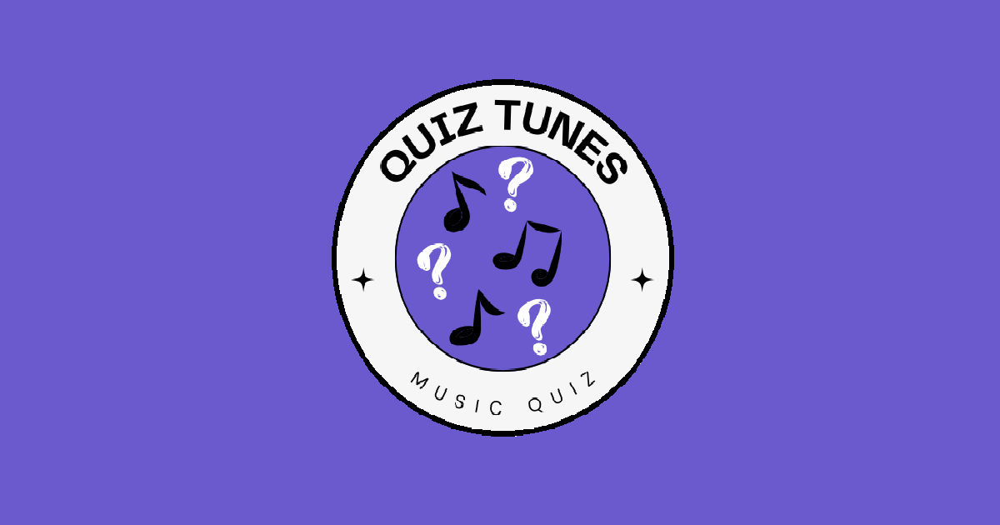
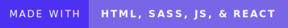

<!-- Ignore Preview because this works fine on github -->

  <h1>Quiz Tunes React</h1>
  
  <table style="margin-top: 20px;">
    <tr>
      <td>
        
      </td>
      <td>
        
      </td>
      <td>
        
      </td>
      <td>
        
      </td>
    </tr>
    <tr>
      <td colspan="4">
        
      </td>
    </tr>
    <tr>
      <td colspan="4" style="padding: 10px;">
        

          Quiz Tunes is a web application built with REACT, HTML, SASS, JavaScript, Spotify API, and the YouTube API. It asks the user a variety of questions in the form of a quiz, then recommends the user a song on Spotify and YouTube based on their quiz results. I became inspired to create a web quiz after a couple of friends showed me this <a href="https://github.com/Gudetea/FruitCard-Odyssey" target="_blank">cute fruit quiz</a> that they found online. Thanks for the inspiration <a href="https://github.com/Gudetea" target="_blank">Gudatea</a>! All the images are Public Domain obtained from <a href="https://www.rawpixel.com/" target="_blank">rawpixel</a> under the <a href="https://creativecommons.org/publicdomain/zero/1.0/" target="_blank">CC0 1.0 Universal License</a>.
        

      </td>
    </tr>
  </table>

<!-- Should mention how I have a version that is just built in basic HTML, CSS, & JavaScript. Also add a link to that repo
Original Project can be found here: https://github.com/Miramoop/Quiz-Tunes -->

<!--Add Icons to each heading -->

## Table of Contents

> - [Clone the Repo](#clone-the-repo)
> - [Create an Environment File](#create-an-environment-file)
> - [Obtain the Spotify API Keys](#obtain-the-spotify-api-keys)
> - [Obtaining the YouTube API Key](#obtain-the-youtube-api-key)
> - [Check for Node and Npm Installations](#check-for-node-and-npm-installations)
> - [Make Repo into React App](#make-repo-into-react-app)

## Clone the Repo

    
Click to show / hide <code>Clone the Repo</code>
 
    

    <ul>
      <li>Clone the Github Repo into any directory of your choice on your local machine.</li>
      <li>Here are the instructions on how to clone the repo if needed:
      <a href="https://docs.github.com/en/repositories/creating-and-managing-repositories/cloning-a-repository" target="_blank">Github Docs on Cloning a Repo</a></li>
      <!--Possibly could add the instructions in here? -->
    </ul>
    
[ <a href="#table-of-contents">↑ Back to Top ↑</a> ]

    

  

## Create an Environment File

  

    
Click to show / hide <code>Create an Environment File</code>
 
    

    <ul>
      <li>Open the project in the code editor of your choice</li>
      <li>Create a file ending in <code>.env</code> at the same level of your directory as the <code>readme.md</code> (outside the public & src folders)</li>
      <!-- Add a photo here --> <!-- Add more instructions here? -->
      <li>Use the below formatting for the <code>.env</code> file, but you must enter in your own keys</li>
    </ul>
    <pre><code>
    REACT_APP_CLIENT_ID=_PLACE YOUR SPOTIFY CLIENT ID CODE HERE
    REACT_APP_CLIENT_SECRET=PLACE YOUR SPOTIFY SECRET ID CODE HERE
    REACT_APP_API_KEY=PLACE YOUR YOUTUBE API KEY HERE
    </code></pre>
    
[ <a href="#table-of-contents">↑ Back to Top ↑</a> ]

    

  

## Obtain the Spotify API Keys

 

    
Click to show / hide <code>Obtain the Spotify API Keys</code>
 
    

    <ul>
      <li>These Keys are obtained at: <a href="https://developer.spotify.com/" target="_blank">Spotify Developer Dashboard</a></li>
      

      <strong>NOTE:</strong> You must log in with a Spotify account (it can be either free or premium)

      <li>Once logged in press your profile at the top right of the screen & select dashboard from the dropdown</li>
      <li>Then click the Create App button (Choose any name and description)</li>
      <li>Set the redirect uri to localhost:3000/</li>
      

      <strong>IMPORTANT:</strong> The redirect uri must be set to this in order for the local server to run properly using react 

      <li>Make sure to select the Web API within the API used category</li>
      <li>Accept Spotify's terms, then press save</li>
      <!--Add image of the proper settings-->
      <li>You can now find the keys by clicking on the app that you just created in your dashboard</li>
      <li>Click the settings button and the keys should appear (client secret is hidden behind a button press)</li>
      <!--Add image of the dashboard showing keys, but blur out mine-->
      <li>Copy & Paste these keys into the .env file created in the steps above</li>
    
[ <a href="#table-of-contents">↑ Back to Top ↑</a> ]

    

  

## Obtain the YouTube API Key

 

    
Click to show / hide <code>Obtain the YouTube API Key</code>
 
    

    <ul> 
    <li>These Keys are obtained at: <a href="https://console.cloud.google.com/apis/dashboard" target="_blank">Google API Dashboard</a></li>
    <li>Sign in or create a Google account</li>
    <li>Click on the top left button titled "Select a Project"</li>
    <li>Press the "New Project" button & Press "Create"</li>
    

    <strong>NOTE:</strong> Any project name and organization can be used

    <li>Once the project is created, press "Enable APIs & Services</li>
    <li>Search for "YouTube Data API v3" & Click to enable it</li>
    <li>Click on the "Credentials" button & then the "Create button"</li>
    <li>Choose the public data option & copy the API key given into the .env file created in the steps above</li>
    <!--Add Images into this to make explanation easier -->
    
[ <a href="#table-of-contents">↑ Back to Top ↑</a> ]

    

  

## Check for Node and Npm Installations

 

    
Click to show / hide <code>Check for Node and Npm Installations</code>
 
    

    <ul> 
    <li>Ensure that you have Node & Npm installed on your local machine</li>
    <li>Open the command prompt & run the command below to check the version of node installed</li>
    <pre><code> node -v </code></pre>
    <li>Open the command prompt & run the command below to check the version of npm installed</li>
    <pre><code> npm -v </code></pre>
    <li>If either of these commands do not give a version or give an error, we must install them</li>
    <li>The instructions for installation can be found at: <a href="https://docs.npmjs.com/downloading-and-installing-node-js-and-npm" target="_blank">Docs on Installation of Node & Npm</a></li>
    <!--Add Images into this to make explanation easier -->
    
[ <a href="#table-of-contents">↑ Back to Top ↑</a> ]

    

  

## Make Repo into React App

 

    
Click to show / hide <code>Make Repo into React App</code>
 
    

    <ul> 
    <li>Open the command prompt & ensure it is in the proper project directory</li>
    <!--Add image here-->
    <li>Run the command below to install the necessary react elements into our project</li>
    <pre><code>npm install create-react-app</code></pre>
    <li>Once installed we can run the project in our local development server</li>
    <li>Open the command prompt & ensure that you are in the proper project directory, then run the below command to start the server:</li>
    <pre><code>npm run start</code></pre>
    

    <strong>IMPORTANT:</strong> To terminate the local development server, select the command prompt used to start the server & press "ctrl + c", then press y when prompted

    </ul>
    <!--Add Images into this to make explanation easier -->
    
[ <a href="#table-of-contents">↑ Back to Top ↑</a> ]

    

  

<!-- Add social links to the bottom, similar to the actual web app -->
