

<h1>Quiz Tunes React</h1>

|  |  |  |  |
| :----------------------------------------------------------------------------------: | :---------------------------------------------------------------------------------: | :---------------------------------------------------------------------------------------------------------------------------------------------: | :--------------------------------------------------------------------------: |

Quiz Tunes is a web application built with REACT, HTML, SASS, JavaScript, Spotify API, and the YouTube API. It asks the user a variety of questions in the form of a quiz, then recommends the user a song on Spotify and YouTube based on their quiz results. I became inspired to create a web quiz after a couple of friends showed me this [cute fruit quiz](https://github.com/Gudetea/FruitCard-Odyssey) that they found online. Thanks for the inspiration [Gudatea](https://github.com/Gudetea)! All the images are Public Domain obtained from [rawpixel](https://www.rawpixel.com/) under the [CC0 1.0 Universal License](https://creativecommons.org/publicdomain/zero/1.0/). The original [QuizTunes](https://github.com/Miramoop/Quiz-Tunes) project was written in basic HTML, CSS, & JavaScript.

## 📝 Table of Contents

- [📝 Table of Contents](#-table-of-contents)
- [👽 Clone the Repo](#-clone-the-repo)
- [🍃 Create an Environment File](#-create-an-environment-file)
- [🎶 Obtain the Spotify API Keys](#-obtain-the-spotify-api-keys)
- [📺 Obtain the YouTube API Key](#-obtain-the-youtube-api-key)
- [💾 Check for Node and Npm Installations](#-check-for-node-and-npm-installations)
- [💻 Make Repo into React App](#-make-repo-into-react-app)
<!-- - [👕 Install all the dependencies for style elements](#-install-style-dependencies) -->

## 👽 Clone the Repo

    
Click to show / hide <code>Clone the Repo</code>
 
    <blockquote>
    <strong>📓NOTE:</strong> We need to clone the Github Repo onto your local machine. If you are not sure how to do this, you can follow the below instructions to learn how to clone the repo.
    </blockquote>
    <ol>
      <li>Open the command prompt on your computer (It will open to the below directory as default)</li>
      <pre><code>C:\Users\YOURUSERNAME></pre></code>
      <li>Click the code button on the <code>GitHub</code> Repo</li>
      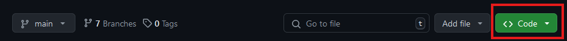
      <li>It opens to reveal the HTTPS code for Cloning the Repo</li>
       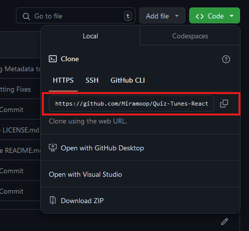
      <li>That link is copied into the below command</li>
      <pre><code>C:\Users\YOURUSERNAME> git clone https://github.com/Miramoop/Quiz-Tunes-React.git</pre></code>
      <blockquote>
      <strong>❗️IMPORTANT:</strong> Make sure to keep the command prompt open for the next step
      </blockquote>
      <li> Here are more instructions on cloning a repo, if you need any help:  <a href="https://docs.github.com/en/repositories/creating-and-managing-repositories/cloning-a-repository">GitHub Docs on Cloning Repos</a></li>
   </ol>

[[↑ Back to Top ↑]](#-table-of-contents)

## 🍃 Create an Environment File

  

    
Click to show / hide <code>Create an Environment File</code>
 
    <ol>
      <li>Navigate to the cloned repo folder on your computer using the below command</li>
         <pre><code>C:\Users\YOURUSERNAME> cd quiz-tunes-react</pre></code>
      <li>Next, we must create an <code>environment file</code> using the following command</li>
       <pre><code>C:\Users\YOURUSERNAME\quiz-tunes-react> echo. > environment.env </pre></code>
      <li>Now we must <code>access the project folder</code> using the following command</li>
      <pre><code>C:\Users\YOURUSERNAME\quiz-tunes-react> start . </pre></code>
      <li>Now right click on the <code>environment file</code> and click open with notepad</li>
      <blockquote>
      <strong>❗️IMPORTANT:</strong> We will get the exact keys that need to be added into this file in the next two steps, so keep this file open.
      </blockquote>
       <li> Here is some more info on <code>environment files</code>, if you need any help:  <a href="https://create-react-app.dev/docs/adding-custom-environment-variables/"> React docs on environment files</a></li>
    </ol>

[[↑ Back to Top ↑]](#-table-of-contents)

  

## 🎶 Obtain the Spotify API Keys

 

    
Click to show / hide <code>Obtain the Spotify API Keys</code>
 
    <ol>
      <li>We must go to the <a href="https://developer.spotify.com/" target="_blank">Spotify Developer Dashboard</a> to get our Spotify API keys
    <blockquote>
    <strong>📓NOTE:</strong> You must log in with a Spotify account (it can be either free or premium)
    </blockquote>
      <li>Once logged in, you must <code>click the button</code> in the top right of the screen and <code>select dashboard</code> from the dropdown</li>
      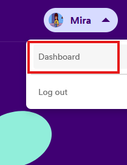
      <li>Then click the <code>Create App button</code></li>
       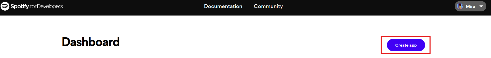
      <li>Create the app name and description (it can be whatever you would like)</li>
       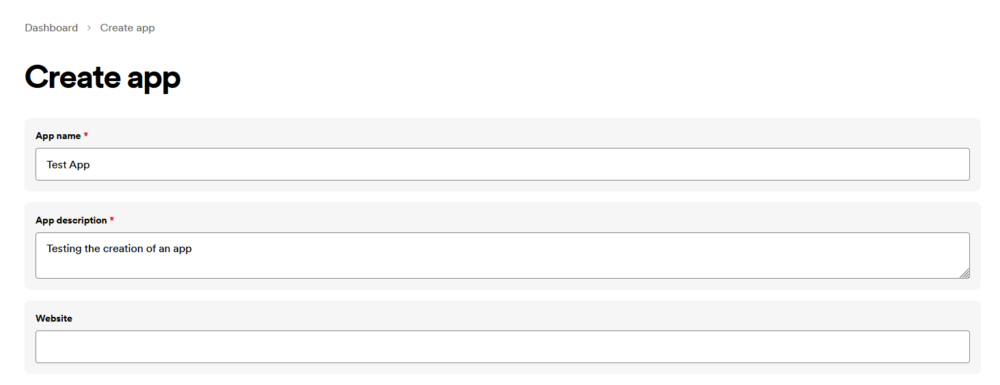
      <li>The redirect uri must be set to localhost:3000/</li>
      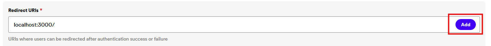
      <blockquote>
      <strong>❗️IMPORTANT:</strong> Ensure you press the add button! Also, the redirect uri must be set to this in order for the local server to run properly using react.
      </blockquote>
      <li>Select the Web API checkbox, read and accept Spotify's terms, then save your app </li>
      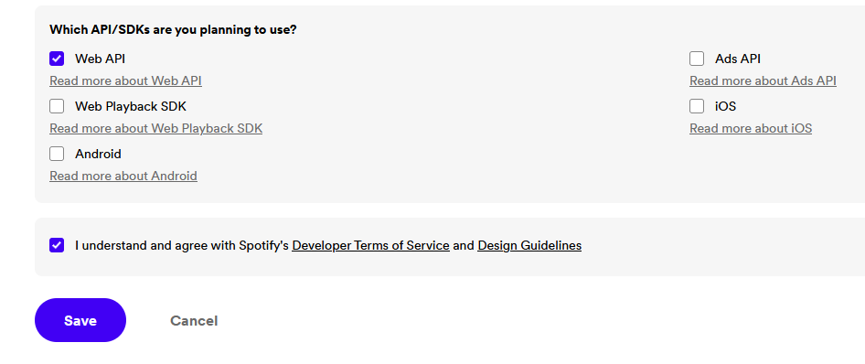
      <li>Click the settings button</li>
      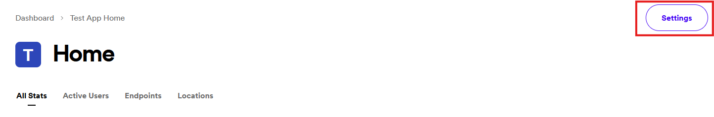
      <li>The Client ID and Client Secret keys will be able to be viewed here (mine is blacked out, but yours won't be)</li>
        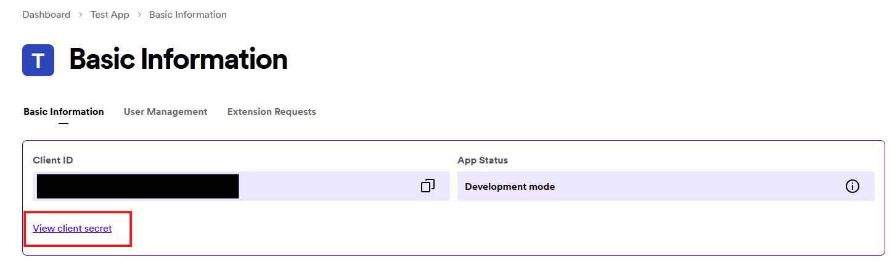
        <blockquote>
        <strong>❗️IMPORTANT:</strong> You must press the view client secret button to see the secret key.
        </blockquote>
      <li>Copy and paste the client id and client secret keys into the <code>environment.env</code> file we created earlier in this format and save the file. Keep the file open for the next step!</li>
         <pre><code>
REACT_APP_CLIENT_ID=PLACE YOUR SPOTIFY CLIENT ID CODE HERE 
REACT_APP_CLIENT_SECRET=PLACE YOUR SPOTIFY SECRET ID CODE HERE
    </code></pre>
    <li> Here is some more info on the Spotify API, if you need any help:  <a href="https://developer.spotify.com/documentation/web-api"> Spotify Docs on their Web API</a></li></ol>

[[↑ Back to Top ↑]](#-table-of-contents)

  

## 📺 Obtain the YouTube API Key

 

    
Click to show / hide <code>Obtain the YouTube API Key</code>
 
    <ol>
      <li>We must go to the <a href="https://console.cloud.google.com/apis/dashboard" target="_blank">Google API Dashboard</a> to obtain our YouTube API Key</li>
      <blockquote>
      <strong>📓NOTE:</strong> You must log in with a Google account
      </blockquote>
      <li>Click on the top left button titled "Select a Project" (mine shows a project name only because I already have created one before)</li>
      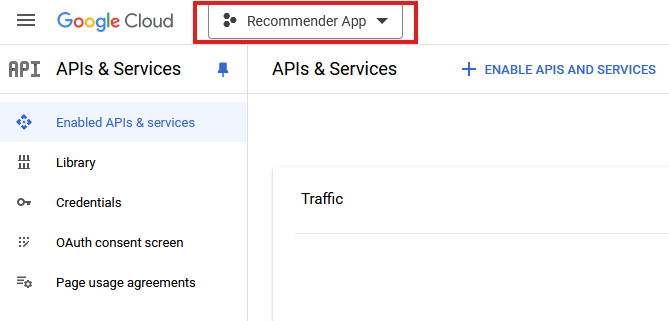
      <li>Press the button titled "New Project"</li>
      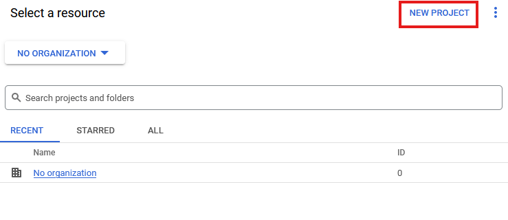
      <li>Create the app name (it can be whatever you would like) and choose any organization. Then press the "Create" button</li>
      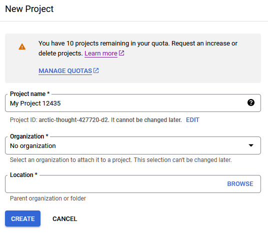
      <li>Press the "Enable APIs and Services" button</li>
      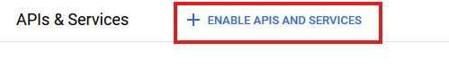
      <li>Search for "YouTube Data API v3" & Click to enable it</li>
      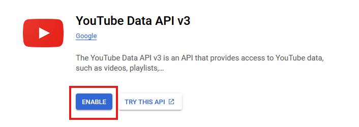
      <li>Click the "Create Credentials" button</li>
      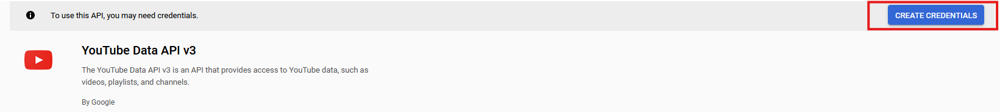
      <li>Select the public data checkbox and press next</li>
      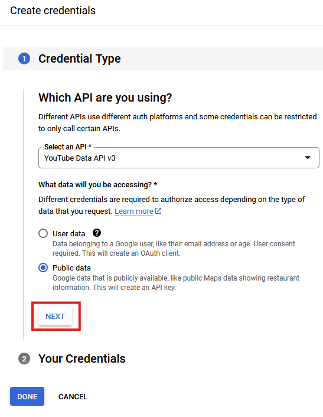
      <li>Now your YouTube API key is given (mine is blacked out but yours won't be)</li>
      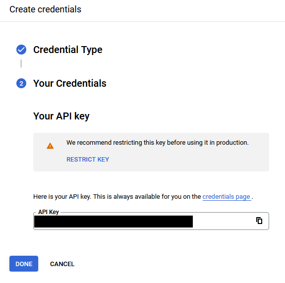
      <li>Copy and paste your YouTube API key into the <code>environment file</code> created in the steps above right below your other two keys</li>
           <pre><code>
REACT_APP_CLIENT_ID=SPOTIFY CLIENT CODE
REACT_APP_CLIENT_SECRET=SPOTIFY SECRET CODE
REACT_APP_API_KEY=PLACE YOUR YOUTUBE API KEY HERE
    </code></pre>
    <li>Save the environment file and you can now close it without any issues</li>
    <li> Here is some more info on the YouTube API, if you need any help:  <a href="https://developers.google.com/youtube/v3/docs"> Google Docs on their YouTube API</a></li>
   </ol>

[[↑ Back to Top ↑]](#-table-of-contents)

  

## 💾 Check for Node and Npm Installations

 

    
Click to show / hide <code>Check for Node and Npm Installations</code>
 
      <blockquote>
      <strong>📓NOTE:</strong> We need to ensure that you have Node & Npm installed on your local machine.
      </blockquote>
    <ol>
      <li>Check for the npm version using the below command</li>
      <pre><code>npm -v</code></pre>
      <li>Check for the node version using the below command</li>
      <pre><code>node -v</code></pre>
      <blockquote>
      <strong>📓NOTE:</strong> If either of these commands do not give a version number or give an error we must install node and npm
      </blockquote>
      <li>Install the latest Long Term Support (LTS) version of Node from this website: <a href="https://nodejs.org/en/download/prebuilt-installer"> Node Downloads Page</a></li>
      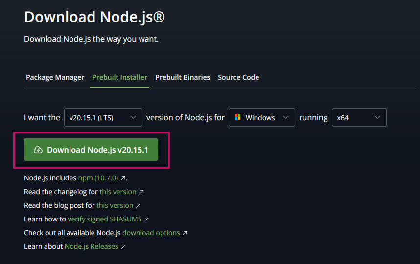
      <li>Run the same commands to check the versions of each to ensure that they installed properly</li>
      <blockquote>
      <strong>❗️IMPORTANT:</strong> If the command prompt does not allow you to run any of these commands. Make sure to exit and run command prompt as administrator
      </blockquote>
      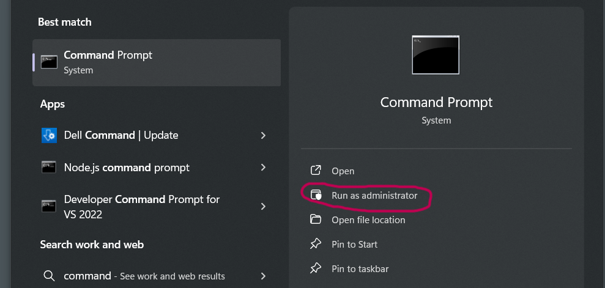
      <li> Here is some more info on Node, if you need any help:  <a href="https://nodejs.org/docs/latest/api/"> Docs on Node</a></li>
      <li> Here is some more info on Npm, if you need any help:  <a href="https://docs.npmjs.com/"> Docs on Npm</a></li>
    </ol>

[[↑ Back to Top ↑]](#-table-of-contents)

  

## 💻 Make Repo into React App

 

    
Click to show / hide <code>Make Repo into React App</code>
 
    <ol>
    <li>Open the command prompt and get to the proper directory for your project using this command</li>
     <pre><code>C:\Users\YOURUSERNAME> cd quiz-tunes-react</pre></code>
    <li>Now that we are in the proper place, we have to make this project into a <code>React</code> app using this command</li>
      <pre><code>C:\Users\YOURUSERNAME\quiz-tunes-react> npm install create-react-app</pre></code>
    <li>Now our project is a <code>React</code> app, we can run it on our local machine using the following command</li>
      <pre><code>C:\Users\YOURUSERNAME\quiz-tunes-react> npm run start</pre></code>
      <blockquote>
      <strong>❗️IMPORTANT:</strong> To terminate the local development server, open the windows powershell that was opened by your local machine to host the local server & press "ctrl + c", then press y when prompted.
      </blockquote>
      <!-- <blockquote>
      <strong>📓NOTE:</strong> You will notice that the styles may not look correct, so it is critical that we install the style dependencies as explained in the next step.
      </blockquote> -->
      <li> Here is some more info on React, if you need any help:  <a href="https://react.dev/"> Docs on React</a></li>
    </ol>

[[↑ Back to Top ↑]](#-table-of-contents)

  

<!-- ## 👕 Install Style Dependencies

  
Click to show / hide <code>Install Style Dependencies</code>
 
  <ol>
  <li>Open the command prompt and get to the proper directory of your project using this command</li>
  <pre><code>C:\Users\YOURUSERNAME> cd quiz-tunes-react</pre></code>
  <li>We must install concurrently to allow the <code>SASS files</code> to be redployed locally whenever changes are made because of the function that I added in the <code>package.json</code> file using this command</li>
  <pre><code>C:\Users\YOURUSERNAME\quiz-tunes-react> npm install concurrently --save-dev</pre></code>
  <li>Install <code>Tailwind CSS</code> in order to properly display the styled components within the cloned project using this command</li>
  <pre><code>C:\Users\YOURUSERNAME\quiz-tunes-react> npm install tailwindcss@latest</pre></code>
  <li>Install the <code>React</code> version of the <code>Tailwind CSS</code> using this command</li>
  <pre><code>C:\Users\YOURUSERNAME\quiz-tunes-react> npm install @headlessui/react @heroicons/react</pre></code>
  <li>Install <code>Daisy UI</code> for some of the styled components within the cloned project</li>
  <pre><code>C:\Users\YOURUSERNAME\quiz-tunes-react> npm i -D daisyui@latest</pre></code>
  <li>We must ensure that we have both <code>React</code> and <code>React-Dom</code> installed using this command</li>
  <pre><code>C:\Users\YOURUSERNAME\quiz-tunes-react> npm install react@latest react-dom@latest</pre></code>
  <li>Install <code>Material UI</code> for the image buttons within the project with this command</li>
  <pre><code>C:\Users\YOURUSERNAME\quiz-tunes-react> npm install @mui/material @emotion/react @emotion/styled</pre></code>
  </ol>

[[↑ Back to Top ↑]](#-table-of-contents)

 -->

<!--
  <li>Install npm using the below command</li>
         <pre><code>npm install latest</code></pre>
      <li>Install node using the below command</li>
         <pre><code>npm install node</code></pre> -->
